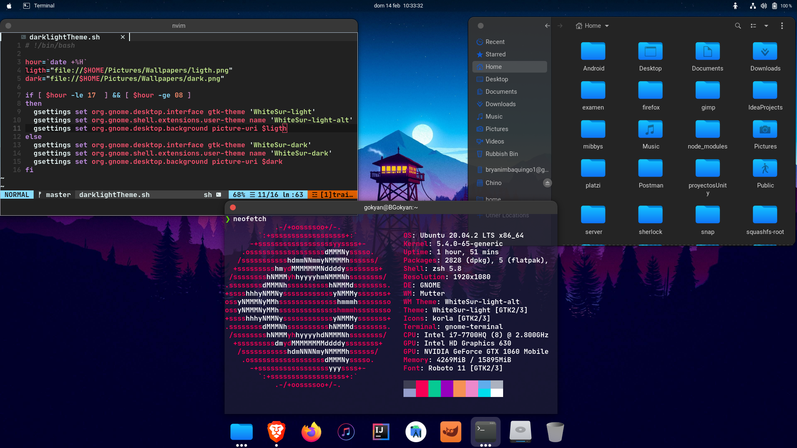
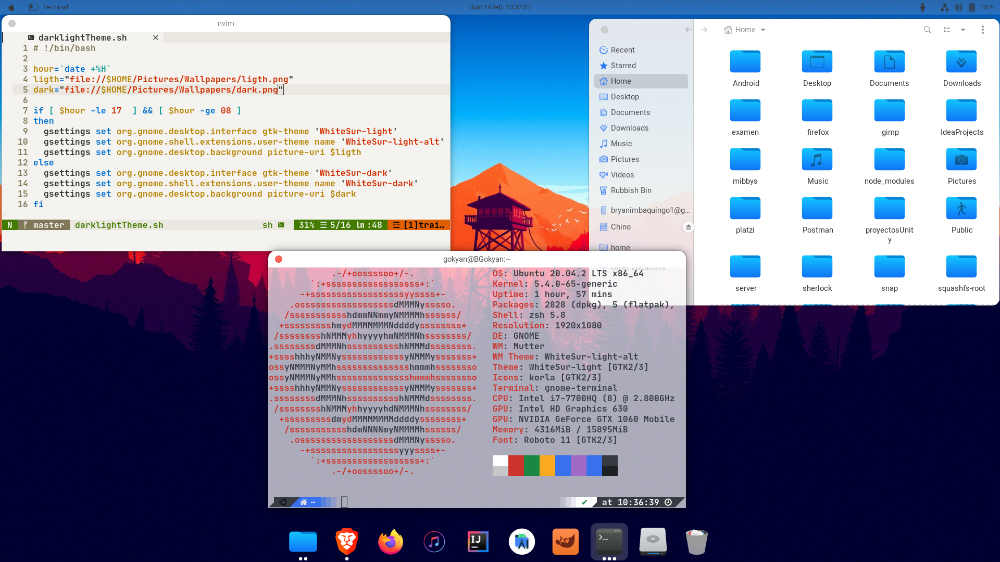

## My Ubuntu config

If you want use this config do this





## Gnome shell theme

#### Icons: [Kora](https://www.pling.com/p/1256209)

#### Gnome theme: [WhiteSur](https://www.pling.com/p/1403328/)

#### Cursor: [Capitaine](https://www.pling.com/p/1148692/)

Download all and install

```
sudo apt-get update
sudo apt-get install gnome-tweak-tool
sudo apt-get install gnome-shell-extension-pixelsaver
```

##### Move WhiteSur theme (dark/ligth)

```
tar xvf ~/Downloads/WhiteSur-dark.tar.xz
sudo mv ~/WhiteSur-dark /usr/share/themes
```

##### Do the same with icons and cursor (cursors and icons are in the same dir)

```
unzip -q ~/Downloads/kora_1-4-1.zip -d ~/Downloads/kora
sudo mv ~/Downloads/kora/\* /usr/share/icons
```

#### finally clone this repo and

```
sh darklightTheme.sh
```

## Terminal

### First install zsh

```
sudo apt-get install zsh git-core -y
```

#### [oh my zsh](https://ohmyz.sh/)

```
sh -c "$(curl -fsSL https://raw.github.com/ohmyzsh/ohmyzsh/master/tools/install.sh)"
```

#### [Gogh](https://mayccoll.github.io/Gogh/) here you find themes for your terminal

#### Copy the gtk.css

```
git clone https://github.com/bimbaquingoch/ubuntuConfig.git
sudo cp gtk.css ~/.config/gtk-3.0/
```

#### to disable close, minimize and maximize buttons run this

```
gsettings set org.gnome.desktop.wm.preferences button-layout :
```

#### to restore this the buttons run

```
gsettings reset org.gnome.desktop.wm.preferences button-layout
```

## My text editor

#### [newNvcode](https://github.com/bimbaquingoch/newNvcode.git) go to this repo

## Finally

```
sudo shutdown -r 0
```
